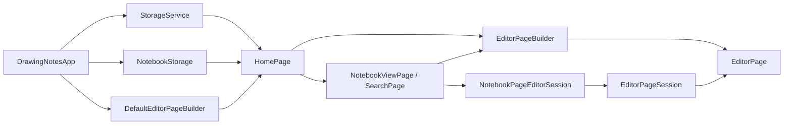

# 当前架构说明

> **适用版本**：`master` 分支，自 2026-08 的 Feature-First 迁移与应用层编辑器装配改造起生效。
> 本文是当前代码结构的唯一操作性说明；历史设计、调研和发布记录保留在其他文档中，仅作背景参考，不应据此判断现行目录。

## 1. 架构目标

项目是面向 Windows 与 Android 的本地离线绘图和笔记应用。当前架构以 **Feature-First** 为顶层组织原则：绘图和笔记各自拥有领域、应用、基础设施与界面代码；应用层负责把具体实现组合为可导航的产品。

```text
lib/
├── main.dart                         # Flutter / Riverpod 启动入口
├── app.dart                          # 应用根：共享依赖生命周期、主题、根路由
├── app/
│   ├── composition_root.dart          # V2 纯 Dart 能力的组合根预留
│   └── default_editor_page_builder.dart
│                                    # 唯一的 notes/drawing UI 组合点
├── core/
│   ├── navigation/editor_page_builder.dart
│   │                                # 中立的编辑器页面构建契约
│   ├── navigation/editor_page_session.dart
│   │                                # 绘图编辑所需的最小分页会话契约
│   ├── notes_accessor.dart            # drawing 使用的笔记访问契约
│   ├── di/                            # Riverpod 共享 provider
│   ├── rendering/                     # 绘制、缓存、几何与导出基础能力
│   ├── security/                      # 会话、策略、媒体加密
│   ├── storage/                       # 本地文件、加密、VFS、导入等适配能力
│   ├── theme/                         # 应用主题
│   └── utils/                         # 无业务归属的工具
├── features/
│   ├── drawing/
│   │   ├── domain/                    # 文档、图层、笔触、选择、对象模型
│   │   ├── application/               # 编辑控制、命令、导出、搜索、输入
│   │   ├── infrastructure/            # 编解码、局部几何/缓存适配
│   │   └── presentation/              # EditorPage、画布和编辑器组件
│   └── notes/
│       ├── domain/                    # 笔记本、页面与笔记管理元数据
│       ├── application/               # NotebookPage 到编辑会话的适配
│       ├── infrastructure/            # NotebookStorage 与访问器实现
│       └── presentation/              # 首页、笔记页、搜索、放映与对话框
├── shared/widgets/                    # 不依赖 features 的可复用 UI
└── l10n/                              # 本地化资源与生成代码

packages/
├── editor_core/                       # 纯 Dart 几何与 V2 文档试点
└── notebook_domain/                   # 仓储、媒体、密钥 ports
```

## 2. 运行时依赖与导航

`DrawingNotesApp` 是生产路径的组合根。它创建单例 `StorageService` 和 `NotebookStorage`，将它们传入 `HomePage`；页面不再在正常应用路径中各自创建新的存储实例。

笔记功能不得直接 import `features/drawing/presentation/editor_page.dart`。`core/navigation/editor_page_builder.dart` 定义 `EditorPageBuilder` 契约，notes 仅依赖这个中立契约；`app/default_editor_page_builder.dart` 才负责把请求映射到具体 `EditorPage`。独立画布使用 `document + documentStorage`；笔记页则由 notes 内的 `NotebookPageEditorSession` 将聚合中的 `NotebookPage` 适配为 `EditorPageSession`，再传入 `session + notebookAccessor + onChanged`。因此，`EditorPage` 只知晓绘图文档、混排元素和页面更新时间，不再直接 import 或接收 notes 领域聚合；放映跳转也以无页面数据泄漏的闭包回调注入。



## 3. 层级边界

| 区域 | 可以依赖 | 不得依赖 |
|---|---|---|
| `app/` | 任意 feature、core、shared | 业务规则和存储细节不应驻留此处。 |
| `features/*/presentation` | 自身 application/domain、core、shared、中立契约 | 另一个 feature 的 `presentation` 或 `infrastructure`。 |
| `features/*/application` | 自身 domain、core、抽象 ports | Widget 和具体跨 feature UI。 |
| `features/*/infrastructure` | 自身 domain、core、平台/文件适配 | presentation；application 对它的反向实现依赖应通过 port 收口。 |
| `features/*/domain` | 同一领域和中立纯 Dart 模型 | `dart:io`、Widget、平台 plugin。 |
| `core/` | Flutter SDK、第三方库、feature 的 domain 实体 | feature 的 application、infrastructure、presentation。 |
| `shared/` | Flutter SDK、core、第三方库 | 任意 feature。 |

`bash tools/check_boundaries.sh` 对 core/shared 的硬性违规返回非零。`test/architecture_test.dart` 额外检查层方向、循环、Feature 隔离和稳定性。架构测试必须从包根收集依赖图，即 `Collector.buildGraph('.')`；不得改回 `../`，否则会扫描上级工作目录并造成高内存、不可复现的验证。

## 4. 当前已知迁移边界

项目不是完全无技术债的终态，但已不存在 drawing **presentation** 对 notes 领域聚合的直接依赖。分页编辑通过 `EditorPageSession` 收口为窄的可变会话，搜索通过只读 DTO 收口，导出通过 `PagedExportSnapshot` 收口；notes 保留其笔记本、加密、文件夹、标签、版本历史与放映导航职责。

绘图运行时的 `DrawingController` 目前只作为组合根和手势协调器。临时墨迹、视口、图层位图缓存、图片解码缓存、整笔橡皮擦、笔画选区、编辑历史以及图片/形状/混合对象编辑，分别由独立会话或协作者持有。其中 `DocumentObjectEditingSession` 通过 `DocumentObjectEditingHost` 取得**当前图层、笔画选区、可逆命令、缓存失效和通知**这组最小协作能力；它不反向引用控制器，也不拥有历史游标或渲染资源。会话内部的 `_DocumentObjectSelectionState` 是形状/图片 id 集合和活动 id 的唯一运行时协调器：它编码跨类型单点选择互斥、混合选择的单对象激活、单类型清理以及快照恢复后的存活修正；该私有暂态不接入 Riverpod，也不拥有文档、历史、缓存或 UI 通知。会话将混合选择的笔画、未锁形状、未锁图片、自由箭头端点和绑定箭头重投影，委托给无状态的 `DocumentObjectTransformService`；将锁定过滤、箭头端点解绑冻结以及形状/图片/笔画集合删除委托给 `DocumentObjectDeletionService`；将框选/套索的形状与图片命中、绑定箭头投影视图和统一选中包围盒委托给 `DocumentObjectGeometryService`；将混合对象快照的深拷贝捕获、集合恢复、内容比较和当前图层索引收敛委托给 `DocumentObjectSnapshotService`。四个协作者都不持有选择状态、命令栈、缓存或 UI。会话仍负责手势事务、撤销命令、文档脏标记与宿主协调，使对象计算可在无 UI 控制器的测试中直接验证，同时保持 `DrawingController` 的既有公开 API 稳定。

`LayerEditingSession` 进一步拥有图层新增、删除、可见性、排序、合并和清空的变更编排及深拷贝快照边界。它通过 `LayerEditingHost` 仅请求**当前图层索引、图层快照命令、缓存注册/释放、局部或全量刷新和通知**，而通用历史游标与命令执行仍由 `DocumentEditHistory` 和控制器宿主负责。因此图层操作可以在不实例化 UI 控制器的测试宿主中独立验证，且历史 extension 只保留兼容 API 和通用事务入口。

`StrokeSelectionEditingSession` 负责已选笔画的平移、缩放、旋转、复制、粘贴、删除与连续手势的单步快照提交。`StrokeSelectionInteractionSession` 负责矩形/套索草稿的开始、延伸、完成及笔画命中编排，并通过 `StrokeSelectionInteractionHost` 区分帧级重绘与状态级通知。两个协作者与 `DrawingSelectionSession` 收口在同一个选区运行时模块中，既共享短生命周期状态，也符合应用层目录的文件数门禁；`SelectionGeometryService` 统一提供点在多边形内和笔画穿越边界判定，使笔画选区与混合对象选择共用同一命中语义。因此 `DrawingController` 的选区扩展仅保留公开 API 委托。

`StrokeInputSession` 拥有原始笔画的活动状态、压力采样、取消、收笔、临时高亮、激光尾迹和手绘形状识别分支。它通过 `StrokeInputHost` 仅请求**当前工具配置、临时墨迹接收、持久笔画/识别形状提交和帧级重绘**；控制器继续拥有文档写入、命令历史、脏区域缓存刷新与低频状态通知。这样，未提交笔画绝不会污染文档或历史，而持久化副作用仍集中于稳定的宿主边界。

编辑器展示层中，`EditorCanvasInteractionState` 专门拥有混排画布的短生命周期交互暂态：单选/多选结果、框选草稿、拖动轨迹、对齐参考线、删除淡出目标、图片裁剪目标及文字缩放锚点。`EditorPage` 仍是 Widget、控制器、页面会话和持久化通知的组合根，并在既有 `setState` 时序内调用该协作者；协作者不持有 `DrawingController`、文档、I/O、Widget 或通知回调。多选、轨迹、参考线和删除目标仅以只读视图提供给 overlay，变更必须经由显式命令完成，以避免多个 `part` 文件绕过页面的状态边界。`_EditorPageCanvasSurface` 仅组合画布、网格、草稿、混排容器、小地图和番茄钟；`_EditorPageTextOverlays` 仅组合就地编辑、斜杠命令、文字展示和文字缩放手柄。二者仍调用页面既有事件委托与状态更新方法，因此拆分只降低展示模块职责密度，不形成新的文档、工具或持久化状态。

`EditorOverlayItemPlan` 是混排对象的只读展示计划：它在画布模式中对文字块排序，在笔记页模式中将文字、图片、形状和图表以类型化条目合并并按 `zOrder` 排序。计划不持有 `Widget`、控制器、页面状态或手势回调；`EditorPage` 只消费条目构建对应 overlay，并继续绑定编辑、选择、拖动、裁剪和缩放动作。该边界消除了按层级排序后为每个条目重复遍历多个集合的页面内分派逻辑。

`EditorToolModeState` 仅维护手型、框选与形状工具的展示层互斥状态；`EditorOverlayGroupResolver` 仅根据文字、图片和形状的 `groupId` 计算不可变的跨类型分组结果；`EditorSelectionTransformState` 仅保存选区缩放/旋转滑块值并输出相对变换增量。`EditorPage` 仍在单个状态更新周期内同步这些协作者、`EditorViewModel`、`DrawingController`、框选草稿和对象变换事务，因此新协作者不会成为第二个文档或工具状态源。

`EditorToolbarActionFactory` 是纯展示层动作映射器：`EditorToolbarBrushActions`、`EditorToolbarObjectActions`、`EditorToolbarShapeActions` 和 `EditorToolbarViewportActions` 以命名分组承接页面提供的回调，工厂无副作用地输出既有 `EditorToolbarActions` 契约。`_EditorPageToolbarActions` 保留各回调的真实 `_applyState`、控制器写入、通知、偏好保存和页面方法调用；`_buildContextBar` 只监听控制器、映射显示状态并消费已装配动作。该分层避免把 40 个业务闭包混入 Widget 构建器，同时不增加任何状态源、延迟包装或 I/O 依赖。

notes 领域进一步将 `PageTemplate`、`CloneRef`、`NotebookPageContent`、`PageVersion`、`NotebookPage` 和 `Notebook` 拆分为职责单一的纯 Dart 模型。`NotebookPageContent` 是一页画布、文字、图片、连接线、形状和图表的唯一活动内容根，统一提供 JSON 序列化、内容签名、深拷贝与保持活动对象身份的恢复操作；`NotebookPage` 只协调页面库元数据、历史上限及版本捕获。既有 `document` 和各混排集合访问器继续转发到同一 `content`，故 `NotebookPageEditorSession` 不会获得第二个内容源。`NotebookViewPage` 只负责保存调度、状态刷新、确认对话框和 I/O，而不再逐项复制、比较或恢复六类对象。

`NotebookPageTemplateStrategy` 进一步收口新建页面的默认内容策略：它只根据 `PageTemplate`、调用方注入的时间和文本 ID 委托创建画布与结构化模板文字，并可生成标准或自定义尺寸的空文档。模板文字、坐标、字体和日期格式因此可以在纯 Dart 测试中精确验证；页面创建、文本导入、PDF 导入和克隆占位仅复用策略的文档/内容装配能力，继续各自拥有用户输入、特有载荷、保存、导航和 I/O。策略不依赖 `BuildContext`、存储、系统时钟或平台 API，故不会反向污染领域边界。

图片和形状的对象选择不再保留独立、未接线的 Riverpod 占位状态。`DocumentObjectEditingSession` 的私有选择协调器是独立画布对象选择的唯一运行时写入源；需要界面刷新时仍通过既有控制器通知与公开只读访问器消费，避免把演示性 Provider 误认为产品状态或引入第二状态源。

下一阶段可评估将重复对象编辑命令迁移为带事务/撤销契约的应用层服务，或将模板策略扩展为受版本控制的用户自定义模板库；两者都必须在独立 PR 中先设计状态、持久化和迁移边界。跨 feature 契约始终只暴露实际用到的数据和操作。

## 5. 本地验证

项目声明 Flutter 3.47.0。推荐的最小验证序列如下：

```bash
flutter pub get
dart analyze
flutter test --concurrency=1
bash tools/check_boundaries.sh
```

若架构测试在内存受限环境中单独执行，可使用：

```bash
flutter test test/architecture_test.dart
```

完整双端验收还必须在 Windows 与 Android SDK/设备环境中进行构建、安装、手写笔输入、保存重开、PDF 导入和导出测试；这些平台验证不能由纯 Dart 单元测试替代。
