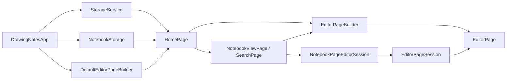

# 当前架构说明

> **适用版本**：`master` 分支，自 2026-08 的 Feature-First 迁移与应用层编辑器装配改造起生效。
> 本文是当前代码结构的唯一操作性说明；历史设计、调研和发布记录保留在其他文档中，仅作背景参考，不应据此判断现行目录。

## 1. 架构目标

项目是面向 Windows 与 Android 的本地离线绘图和笔记应用。当前架构以 **Feature-First** 为顶层组织原则：绘图和笔记各自拥有领域、应用、基础设施与界面代码；应用层负责把具体实现组合为可导航的产品。

```text
lib/
├── main.dart                         # Flutter / Riverpod 启动入口
├── app.dart                          # 应用根：共享依赖生命周期、主题、根路由
├── app/
│   ├── composition_root.dart          # V2 纯 Dart 能力的组合根预留
│   └── default_editor_page_builder.dart
│                                    # 唯一的 notes/drawing UI 组合点
├── core/
│   ├── navigation/editor_page_builder.dart
│   │                                # 中立的编辑器页面构建契约
│   ├── navigation/editor_page_session.dart
│   │                                # 绘图编辑所需的最小分页会话契约
│   ├── notes_accessor.dart            # drawing 使用的笔记访问契约
│   ├── di/                            # Riverpod 共享 provider
│   ├── rendering/                     # 绘制、缓存、几何与导出基础能力
│   ├── security/                      # 会话、策略、媒体加密
│   ├── storage/                       # 本地文件、加密、VFS、导入等适配能力
│   ├── theme/                         # 应用主题
│   └── utils/                         # 无业务归属的工具
├── features/
│   ├── drawing/
│   │   ├── domain/                    # 文档、图层、笔触、选择、对象模型
│   │   ├── application/               # 编辑控制、命令、导出、搜索、输入
│   │   ├── infrastructure/            # 编解码、局部几何/缓存适配
│   │   └── presentation/              # EditorPage、画布和编辑器组件
│   └── notes/
│       ├── domain/                    # 笔记本、页面与笔记管理元数据
│       ├── application/               # NotebookPage 到编辑会话的适配
│       ├── infrastructure/            # NotebookStorage 与访问器实现
│       └── presentation/              # 首页、笔记页、搜索、放映与对话框
├── shared/widgets/                    # 不依赖 features 的可复用 UI
└── l10n/                              # 本地化资源与生成代码

packages/
├── editor_core/                       # 纯 Dart 几何与 V2 文档试点
└── notebook_domain/                   # 仓储、媒体、密钥 ports
```

## 2. 运行时依赖与导航

`DrawingNotesApp` 是生产路径的组合根。它创建单例 `StorageService` 和 `NotebookStorage`，将它们传入 `HomePage`；页面不再在正常应用路径中各自创建新的存储实例。

笔记功能不得直接 import `features/drawing/presentation/editor_page.dart`。`core/navigation/editor_page_builder.dart` 定义 `EditorPageBuilder` 契约，notes 仅依赖这个中立契约；`app/default_editor_page_builder.dart` 才负责把请求映射到具体 `EditorPage`。独立画布使用 `document + documentStorage`；笔记页则由 notes 内的 `NotebookPageEditorSession` 将聚合中的 `NotebookPage` 适配为 `EditorPageSession`，再传入 `session + notebookAccessor + onChanged`。因此，`EditorPage` 只知晓绘图文档、混排元素和页面更新时间，不再直接 import 或接收 notes 领域聚合；放映跳转也以无页面数据泄漏的闭包回调注入。



## 3. 层级边界

| 区域 | 可以依赖 | 不得依赖 |
|---|---|---|
| `app/` | 任意 feature、core、shared | 业务规则和存储细节不应驻留此处。 |
| `features/*/presentation` | 自身 application/domain、core、shared、中立契约 | 另一个 feature 的 `presentation` 或 `infrastructure`。 |
| `features/*/application` | 自身 domain、core、抽象 ports | Widget 和具体跨 feature UI。 |
| `features/*/infrastructure` | 自身 domain、core、平台/文件适配 | presentation；application 对它的反向实现依赖应通过 port 收口。 |
| `features/*/domain` | 同一领域和中立纯 Dart 模型 | `dart:io`、Widget、平台 plugin。 |
| `core/` | Flutter SDK、第三方库、feature 的 domain 实体 | feature 的 application、infrastructure、presentation。 |
| `shared/` | Flutter SDK、core、第三方库 | 任意 feature。 |

`bash tools/check_boundaries.sh` 对 core/shared 的硬性违规返回非零。`test/architecture_test.dart` 额外检查层方向、循环、Feature 隔离和稳定性。架构测试必须从包根收集依赖图，即 `Collector.buildGraph('.')`；不得改回 `../`，否则会扫描上级工作目录并造成高内存、不可复现的验证。

## 4. 当前已知迁移边界

项目不是完全无技术债的终态，但已不存在 drawing **presentation** 对 notes 领域聚合的直接依赖。分页编辑通过 `EditorPageSession` 收口为窄的可变会话，搜索通过只读 DTO 收口，导出通过 `PagedExportSnapshot` 收口；notes 保留其笔记本、加密、文件夹、标签、版本历史与放映导航职责。

绘图运行时的 `DrawingController` 目前只作为组合根和手势协调器。临时墨迹、视口、图层位图缓存、图片解码缓存、整笔橡皮擦、笔画选区、编辑历史以及图片/形状/混合对象编辑，分别由独立会话或协作者持有。其中 `DocumentObjectEditingSession` 通过 `DocumentObjectEditingHost` 取得**当前图层、笔画选区、可逆命令、缓存失效和通知**这组最小协作能力；它不反向引用控制器，也不拥有历史游标或渲染资源。这使对象选择、锁定、变换、删除和快照恢复可在无 UI 控制器的测试宿主中验证，同时保持 `DrawingController` 的既有公开 API 稳定。

`LayerEditingSession` 进一步拥有图层新增、删除、可见性、排序、合并和清空的变更编排及深拷贝快照边界。它通过 `LayerEditingHost` 仅请求**当前图层索引、图层快照命令、缓存注册/释放、局部或全量刷新和通知**，而通用历史游标与命令执行仍由 `DocumentEditHistory` 和控制器宿主负责。因此图层操作可以在不实例化 UI 控制器的测试宿主中独立验证，且历史 extension 只保留兼容 API 和通用事务入口。

`StrokeSelectionEditingSession` 负责已选笔画的平移、缩放、旋转、复制、粘贴、删除与连续手势的单步快照提交。它通过 `StrokeSelectionEditingHost` 只取得**当前图层、选区会话、图层快照命令、局部缓存失效和通知**；矩形/套索草稿和命中检测仍在控制器兼容扩展中，以便直接配合当前图层和高频画布刷新。这样既把低频文档编辑从控制器迁出，也保留了现有 UI API 与选区手势时序。

下一阶段应优先评估把选区草稿和笔画命中检测收口为纯几何协作者，或将 `PageTemplate`、`CloneRef` 和 `PageVersion` 等笔记管理模型与可编辑页面载荷分离；跨 feature 契约始终只暴露实际用到的数据和操作。

## 5. 本地验证

项目声明 Flutter 3.47.0。推荐的最小验证序列如下：

```bash
flutter pub get
dart analyze
flutter test --concurrency=1
bash tools/check_boundaries.sh
```

若架构测试在内存受限环境中单独执行，可使用：

```bash
flutter test test/architecture_test.dart
```

完整双端验收还必须在 Windows 与 Android SDK/设备环境中进行构建、安装、手写笔输入、保存重开、PDF 导入和导出测试；这些平台验证不能由纯 Dart 单元测试替代。
