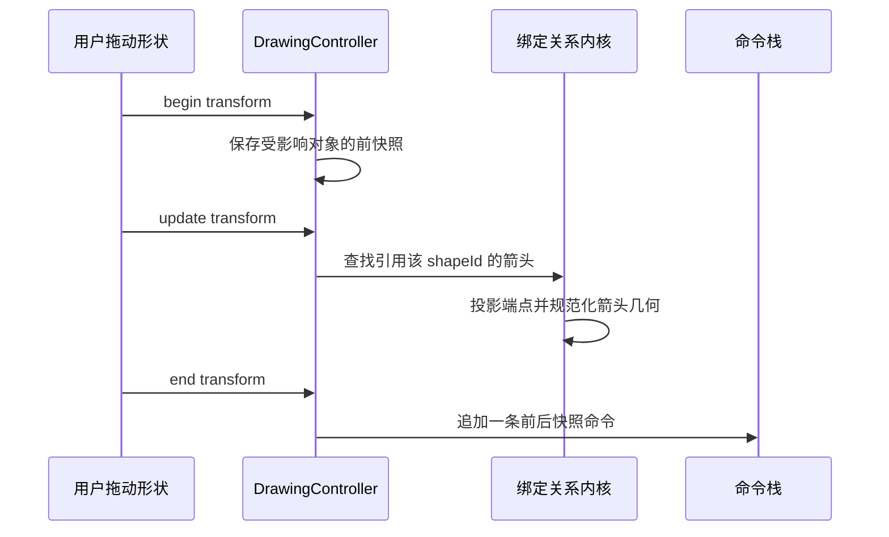

# 双端绑定箭头：最小正确实施设计

**日期：** 2026-08-14  
**范围：** 独立绘图文档（`DrawingDocument`）  
**目标：** 让直线箭头成为与形状保持关系的对象，而不是一次性画出的静态斜线。

## 设计边界

第一版只支持 `ShapeType.arrow` 连接两个矩形、椭圆或菱形。端点可分别绑定或保持自由。绑定存储为 **目标形状 ID + 相对目标外接框的归一化锚点**；移动/缩放目标形状后，由控制器统一重新投影箭头。第一版不实现肘形路径、障碍物避让、文本标签、组内复制关系或协作分数排序。

| 能力 | 第一版设计 | 不做的事情 |
|---|---|---|
| 端点绑定 | `ShapeEndpointBinding(targetShapeId, anchorX, anchorY)` | 多边形精确边界吸附、动态 gap |
| 箭头几何 | 起点/终点由外接框和 `flipX/flipY` 表达 | 多点折线、手动中点编辑 |
| 移动目标 | 重新投影所有引用目标的箭头 | 自动布局、避障路由 |
| 删除目标 | 绑定端点冻结为当前绝对位置，解除关系 | 删除整个箭头或重连建议 |
| 历史 | 目标变换、所有受影响箭头和关系作为一条命令 | 跨对象协作操作日志 |
| 保存 | JSON 可前向兼容，旧箭头继续可读 | 公网协议或云同步 |

## 数据协议

```dart
class ShapeEndpointBinding {
  final String targetShapeId;
  final double anchorX; // 0..1
  final double anchorY; // 0..1
}

class PageShapeItem {
  ShapeEndpointBinding? startBinding; // 仅 arrow 使用
  ShapeEndpointBinding? endBinding;   // 仅 arrow 使用
}
```

箭头在绑定后仍保存当前几何作为离线回退和导出基础。渲染前/变换后以 `target.x + target.width * anchorX`、`target.y + target.height * anchorY` 计算全局端点，再把端点规范化为现有正宽高 + `flipX/flipY` 表达。`anchor` 必须在 `0..1`，反序列化时也必须夹紧。

## 事务顺序



删除目标时，应先读取每个受影响箭头绑定端点的当前绝对位置，清除相应绑定，再删除目标。这样箭头保留为可编辑的自由箭头，且撤销可恢复目标与完整关系。

## 验收用例

| 编号 | 场景 | 断言 |
|---|---|---|
| B1 | 左右两个矩形创建绑定箭头 | 两端 ID 与归一化锚点保存重开一致 |
| B2 | 移动左侧矩形 | 起点随矩形同量平移；终点不漂移；仅一条撤销记录 |
| B3 | 缩放右侧矩形 | 终点按锚点比例重投影；箭头方向正确 |
| B4 | 删除其中一端 | 删除端变自由点；另一端保持绑定；撤销恢复 |
| B5 | 锁定形状 | 锁定目标不可变换，绑定不被意外改写 |
| B6 | PNG 导出 | 使用投影后箭头几何，画布/导出一致 |

## 参考资料

[1] [Excalidraw Binding](https://github.com/excalidraw/excalidraw/blob/master/packages/element/src/binding.ts)  
[2] [Excalidraw Linear Element Editor](https://github.com/excalidraw/excalidraw/blob/master/packages/element/src/linearElementEditor.ts)  
[3] [Excalidraw Elbow Arrow](https://github.com/excalidraw/excalidraw/blob/master/packages/element/src/elbowArrow.ts)
