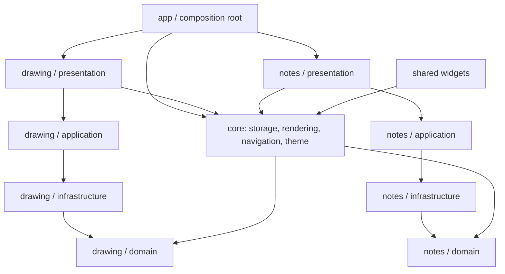

# Drawing Notes App 当前代码结构评估报告

**作者：Manus AI**  
**评估日期：2026-08-27**  
**评估基线：`master` 的 `be19366`（PR #28 合并提交）**
**评估性质：仓库静态结构、依赖边界、代码规模、测试与门禁审计；不是运行时性能基准或安全渗透测试。**

## 执行摘要

该项目已经不是“没有结构”的原型代码，而是一个**正在持续收口的 Feature-First Flutter 应用**。主干以 `drawing` 和 `notes` 两个业务 feature 为核心，feature 内部按 `domain`、`application`、`infrastructure`、`presentation` 分层；核心存储、渲染、主题、导航和共享控件位于 `core/` 与 `shared/`。项目已具备架构测试、依赖方向检查、代码行数/目录容量门禁、秘密扫描和 Android/Windows 构建证据，因此基本工程治理能力是存在且实际执行的。[1] [2]

> **总体结论：结构正常、可持续开发，但尚未达到低耦合终态。** 目前适合继续在既有架构上迭代，而不应启动高风险“大重写”。最主要的后续风险不是缺少目录，而是少数逻辑组合根仍然过大、`part` 私有库扩大了理解范围、应用层文件预算接近上限，以及核心存储对绘图编解码的历史跨层例外。命令循环、feature 隔离和 onion 方向均已恢复为严格架构门禁。

本轮在报告审计基础上完成两项边界一致的实际治理：第一，移除没有生产接线、仅被自身测试消费的对象选择 Riverpod 占位状态，避免它被误当作第二写入源；第二，将编辑器画布表面和文字叠层从对象叠层模块中按职责拆出。该批改动只重组展示与状态边界，**不改变用户可见功能、文档格式、控制器公开 API 或持久化时序**。

| 结论维度 | 当前判断 | 依据与含义 |
|---|---|---|
| 总体架构 | **B+：正常、可维护、仍需持续治理** | Feature-First 分层和自动门禁有效；组合根与历史豁免尚未完全收口 |
| 领域建模 | **A-** | notes 的页面内容、版本、模板和聚合已拆为纯 Dart 领域对象，兼容入口保留现有导入方式 [1] |
| 编辑器应用层 | **B** | 会话/服务已较细，但控制器与对象编辑会话仍为大文件，目录容量需要谨慎管理 |
| 编辑器展示层 | **B** | 已从单页巨型文件显著拆分；仍由同一私有 `part` 库共享状态，下一步应引入更窄的协作者契约而非继续机械分文件 |
| 存储与安全边界 | **B** | 本地加密存储、编解码与秘密扫描已纳入工程；核心存储仍存在文档编解码的历史跨层例外 [2] |
| 自动化质量 | **A-** | 全量测试、分析、边界、行数、静态安全与双平台构建均有持续门禁；测试目录结构仍偏扁平 |

## 1. 评估范围与方法

本报告以合并后的 `master@be19366` 为基线，使用仓库内的源文件计数、物理行数、依赖检索、`part` 库清单、架构测试、边界脚本、CI 门禁配置和近期合并历史进行审计。统计的“行数”是物理行数，用于识别维护热点，并不等价于业务复杂度或缺陷数量。

审计未执行网络服务、云同步或真实终端设备基准测试；因此报告不对帧率、电池、加密强度或端到端 UX 作超出仓库证据的结论。所有优先级建议均以**低风险、可独立审阅、保持受保护 `master` 流程**为前提。

## 2. 可复核的规模与结构基线

| 指标 | 基线数值 | 解读 |
|---|---:|---|
| `lib/` Dart 文件 | 156 | 主代码已具备模块规模，不能再用单一文件/单层思路维护 |
| `test/` Dart 文件 | 121 | 回归资产覆盖面较广，但其中 118 个测试位于 `test/` 根目录，发现性有提升空间 |
| 主代码物理行数 | 约 29,117 | 由顶层目录汇总；规模已进入需要治理组合根与边界的阶段 |
| `drawing` feature | 90 文件、17,950 行 | 最大功能域，编辑器、渲染、输入、历史与导出集中于此 |
| `notes` feature | 21 文件、4,787 行 | 页面内容、模板、版本、加密笔记本与笔记本展示构成第二功能域 |
| `drawing/presentation` | 33 文件、9,962 行 | 最大且最值得持续治理的层；本轮后会因内聚拆分增加到 35 文件，但仍低于 40 文件硬限制 |
| `drawing/application` | 40 文件 | 基线已达到目录上限；本轮删除未接线占位状态后降至 39，为后续真正需要的应用协作者释放一个位置 |
| 单文件硬限制 | 1,000 行 | `.sloc-guard.toml` 将超过 1,000 行设为错误，500 行开始预警 [3] |

编辑器页面采用“一个 Stateful 组合根 + 同库私有 `part` 扩展”的渐进拆分方式。该方式允许拆出的扩展继续受 Dart 私有可见性保护，避免为了拆文件而把大量内部状态公开；但也意味着真正的状态拥有者仍是同一 `_EditorPageState`，文件数量增加不会天然降低业务耦合。[1]

## 3. 结构优势

### 3.1 Feature-First 已经落地，而非仅有目录名称

`drawing` 和 `notes` 均包含领域、应用、基础设施和展示层，近期改造已将笔记页内容、历史版本、模板初始内容、编辑器短生命周期交互状态、对象选择状态、工具栏动作装配和 overlay 计划拆到职责清晰的协作者中。[1] 这使当前主线比“页面直接读写所有 JSON、所有页面直接持有全量状态”的典型 Flutter 原型更容易测试和审阅。

### 3.2 领域层的纯化方向正确

notes 已把 `PageTemplate`、`CloneRef`、`NotebookPageContent`、`PageVersion`、`NotebookPage` 和 `Notebook` 拆开；其中 `NotebookPageContent` 统一承载六类活动内容、序列化、签名、深拷贝与恢复，而 `NotebookPage` 负责元数据与历史协调。这显著降低了展示层保存/恢复重复实现的概率。[1]

### 3.3 对象编辑已由“控制器膨胀”转向会话与无状态服务协作

`DocumentObjectEditingSession` 通过窄的 `DocumentObjectEditingHost` 访问文档、历史、缓存和通知；几何、变换、删除和快照分别委托给无状态服务。最新选择协调器进一步确保图片/形状的单点选择互斥、混合选择激活规则和快照恢复后的存活修正集中在一个会话私有状态中。[1]

### 3.4 自动化治理不是纸面规则

架构测试对层方向、循环、feature 隔离、onion 方向及稳定性指标执行严格断言；边界脚本阻止 `core/`、`shared/` 依赖 feature 的非 domain 层；远程 PR 同时执行质量、架构、安全、秘密扫描、代码规模、Android 与 Windows 门禁。[2] [3] 已消除的问题不得继续以 `freeze` 弱化为只拦截新增，以上机制应继续作为合并前不可降级的底线。

## 4. 当前风险与技术债

| 优先级 | 风险 | 当前证据 | 影响 | 建议方向 |
|---|---|---|---|---|
| P0 | 编辑器组合根仍大 | `editor_page.dart` 为 1,124 行，`editor_page_overlays.dart` 基线为 899 行；多个 `part` 共享同一私有状态 | 修改输入、overlay、工具栏时仍需理解大量隐式状态 | 继续按明确展示职责提取窄协作者/动作契约；不要仅为降低行数继续增加没有边界的 `part` |
| P0 | 应用层目录容量紧张 | `drawing/application` 基线为 40 文件，达到配置上限 | 新增应用服务可能触发门禁，迫使不合理的文件合并 | 先删除死代码、合并真正同域的小模块或把大模块分解后替换旧文件；每次新增前核验目录预算 |
| 已完成 | 严格架构门禁恢复 | 命令—控制器环、feature 横向外层导入与 onion 反向依赖均经审计不存在 | 未来违规直接由 CI 阻断，而非被基线掩盖 | 维持严格断言，不重新引入 `freeze` |
| P0 | 核心存储仍有历史跨层例外 | 边界脚本允许 `storage_service.dart` 依赖 `document_codec` | 共享存储抽象与绘图编解码耦合，未来替换存储或支持更多文档类型成本偏高 | 用 codec 注册表或小型注入接口隔离，保持加密/原子保存语义不变 |
| P1 | 测试文件分布偏扁平 | 118 个测试位于 `test/` 根目录 | 同域测试发现、所有权和批量执行定位成本提高 | 先按 feature 建立新测试目录；历史测试只在改动关联域时渐进迁移，避免无收益的大搬家 |
| P1 | 大型展示/存储文件仍超过预警线 | `home_page.dart` 829、`editor_toolbar.dart` 774、`editor_page_editing.dart` 764、`notebook_storage.dart` 554 行 | 局部变更的审阅面较大，合并冲突与回归风险上升 | 优先提取纯映射、输入模型、保存协调或无状态渲染契约；不改变 Widget 生命周期与 I/O 时序 |
| P2 | 本地 path package 边界需持续验证 | `editor_core`、`notebook_domain` 已声明为 path dependency | 包结构意图明确，但若实际职责迁移不持续，可能形成“目录与包边界不一致” | 先列出每个包的公开 API 与依赖图，再分批迁移纯领域类型；不为形式迁移 Flutter/UI 代码 |

## 5. 本轮实际改造

### 5.1 清除未接线的对象选择占位状态

审计发现 `object_selection_notifiers.dart` 的 `ImagesState`、`ShapesState` 及对应 Provider 在生产 `lib/` 中没有任何消费者，只有其自测引用。它们无法反映 `DocumentObjectEditingSession` 的真实运行时选择；继续保留既会误导后续维护者，也与“会话是唯一写入源”的约束冲突。

本轮移除了该文件和两个仅验证占位状态自身的测试，并更新架构文档。真实对象选择仍通过会话、控制器通知和公开只读访问器工作，因此该改动不是减少功能，而是删除没有接入的伪状态源。

### 5.2 按展示职责拆分叠层组合

基线中的 `editor_page_overlays.dart` 同时负责状态栏、画布表面、小地图、番茄钟、overlay 项目分派、图表、形状、文字、就地编辑、斜杠命令与图片展示。该职责跨度过大。

本轮将其中两组内聚职责移出：`_EditorPageCanvasSurface` 仅组合画布、网格、草稿、混排容器、小地图和番茄钟；`_EditorPageTextOverlays` 仅组合文字就地编辑、斜杠命令、文字展示与缩放手柄。原文件只保留 overlay 项目计划分派及图表、形状、图片对象叠层。新 extension 仍属于 `editor_page.dart` 同一私有库，只调用既有页面状态与回调，故不会形成新的文档、工具、持久化或控制器状态源。

| 项目 | 改造前 | 改造后 | 结果 |
|---|---:|---:|---|
| `editor_page_overlays.dart` | 899 行 | 288 行 | 只保留对象叠层计划分派与图表/形状/图片职责 |
| 画布表面部件 | 混入 overlay 文件 | 230 行 | 明确承接画布、网格、草稿和导航展示职责 |
| 文字叠层部件 | 混入 overlay 文件 | 393 行 | 明确承接文字编辑与展示职责 |
| 对象选择占位 Provider | 121 行、未接线 | 已删除 | 真实选择状态保持单一写入源 |
| `drawing/application` 文件数 | 40 | 39 | 为后续真正需要的应用协作者释放容量 |

## 6. 建议的后续路线

| 批次 | 优先目标 | 预期收益 | 进入条件 | 明确非目标 |
|---|---|---|---|---|
| A（已完成） | 严格架构门禁恢复 | 将命令—控制器、feature 隔离与 onion 方向的历史豁免转化为持续执行的 CI 保证 | 审计实际导入图并通过全量架构测试 | 不重写历史功能，不改变用户撤销栈格式 |
| B | 存储 codec 接口化 | 消除 core 对绘图基础设施的历史例外，为多文档类型或存储替换做准备 | 完整覆盖加密、版本、迁移、原子保存和恢复失败测试 | 不更换加密方案，不引入云同步 |
| C | `EditorPage` 从 `part` 私有库走向窄协作者契约 | 让输入、overlay、工具栏共享状态改为显式只读输入和命名动作 | 先确定一组行为稳定的叶职责（如图片裁剪 UI 或文字渲染样式） | 不将 `BuildContext`、控制器和持久化下沉到纯状态对象 |
| D | 渐进整理测试所有权 | 提升定位和审阅效率，减少根目录扁平化 | 仅迁移正在修改 feature 的相关测试，并保留命令兼容入口 | 不做只改路径的大搬家，不降低全量回归 |
| E | 模板策略的用户自定义持久化 | 让领域模板从内置枚举演进为受版本控制的配置 | 先定义模板 schema、升级策略和加密持久化语义 | 不在未定义迁移策略前直接写入用户数据 |

批次 A 已由 PR #28 和本轮严格边界审计完成。下一步建议优先启动**批次 B：存储 codec 接口化**，但必须先在独立设计中锁定加密、原子写、迁移、版本恢复与失败回滚的可观察行为；它的风险明显高于纯门禁恢复，不能与展示层重构混入同一 PR。

## 7. 验收与复核清单

后续每一批改造应持续满足以下不变量：

1. 不直接改动、推送或合并受保护的 `master`；必须采用 feature branch → PR → 远程门禁 → 人工审核/合并流程。
2. 保持 Flutter 串行全量测试、静态分析、`tools/check_boundaries.sh`、`git diff --check` 和远程 14 项门禁。
3. 在新增 application/presentation 文件前检查 `.sloc-guard.toml` 的 40 文件目录上限和 500/1,000 行阈值。
4. 任何对历史、对象选择、文档恢复或存储的重构，必须同时锁定撤销/重做、取消、恢复、缓存失效、选择修正和通知次数。
5. 不以“拆文件”替代职责隔离；新的协作者必须拥有明确的输入、输出、状态拥有者和非职责。

## 结论

当前代码**是正常的、有架构和有工程门禁的 Flutter 项目**，并且经过连续重构后已经从早期的“编辑器和笔记模块集中式胶水代码”演进到以会话、纯领域对象、无状态服务和展示协作者为主的结构。审计确认命令—控制器历史导入环已通过窄 `DocCommandContext` 契约消除；零循环、feature 隔离与 onion 方向现在均为严格门禁。主要剩余问题是规模增长后的组合根、核心存储例外与容量约束，而不是架构缺失。

因此，最稳妥的策略不是推倒重来，而是继续维持现有的受保护分支流程，围绕严格架构门禁、存储例外、大型组合根和测试所有权做小批次、可验证、可回滚的连续改造。报告中的路线图可以作为未来 3–5 个独立 PR 的优先级依据。

## 参考资料

[1] [项目架构说明（`master@be19366`）](https://github.com/bear20252026/drawing_notes_app/blob/be193667c95f3b92e890960d7844d3449f9892c9/docs/ARCHITECTURE.md)
[2] [架构测试（`master@be19366`）](https://github.com/bear20252026/drawing_notes_app/blob/be193667c95f3b92e890960d7844d3449f9892c9/test/architecture_test.dart)
[3] [代码规模与目录门禁配置（`master@be19366`）](https://github.com/bear20252026/drawing_notes_app/blob/be193667c95f3b92e890960d7844d3449f9892c9/.sloc-guard.toml)
