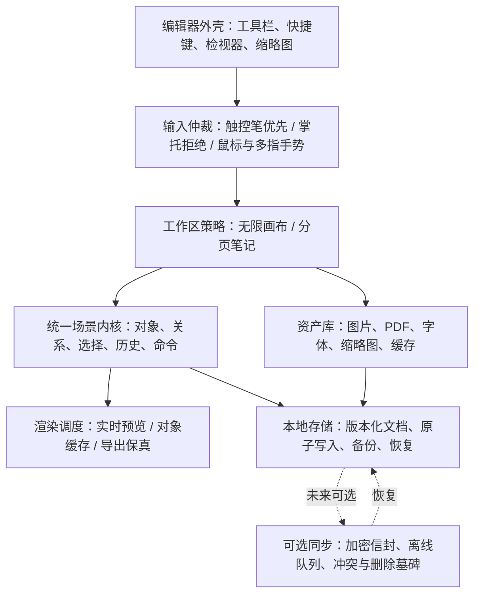

# 绘图笔记应用大师级统一架构蓝图

**作者：** Manus AI  
**日期：** 2026-08-14  
**目标平台：** Windows / Android  
**参考边界：** Excalidraw（MIT，架构参考及必要时保留许可的可隔离复用）；Saber（GPL-3.0，仅研究行为和架构原则，全部代码独立实现）

## 1. 北极星：一个内核，两种工作区，而非两个割裂产品

本应用应定位为 **“手写优先的知识画布”**。用户可以在无限白板上快速思考、建立流程与结构图；也可以在可打印分页笔记中阅读 PDF、书写、整理图片和文本。两种体验不同，但都建立在同一个可编辑对象内核上。

> **无限画布追求空间思考速度；分页笔记追求资料阅读、书写秩序和长期归档。**
>
> 不应让分页笔记假装成无限白板，也不应把无限白板限制成纸张。它们共享对象、手势、历史与资源管理，但拥有各自的背景、导航、导出与默认交互策略。

| 工作区 | 用户主任务 | 默认画布 | 高优先级交互 | 输出重点 |
|---|---|---|---|---|
| 无限绘图 | 画图、头脑风暴、流程、关系图 | 无限坐标平面 | 手型平移、对象多选、吸附、绑定箭头、分组、框架 | PNG、SVG、可编辑 JSON、演示帧 |
| 分页笔记 | 课堂/会议记录、PDF 批注、归档 | 固定页面或 PDF 底图 | 触控笔优先、手掌拒绝、连续书写、缩略图、资料阅读 | PDF、RTF/Word 兼容、页面图片 |

Excalidraw 的元素、资源、绑定与场景思想适合形成无限白板内核；Saber 的笔迹处理、高亮笔、PDF 资料和阅读模式适合形成分页笔记体验。[1] [2]

## 2. 目标分层

该分层的关键约束是：**输入、运行时缓存和显示效果不能直接成为持久化事实**。原始笔画点列、对象属性、资源引用和命令意图才是文档事实；轮廓、位图、PDF 文档句柄、激光尾迹、选区草稿、反相滤镜和手势状态都属于可丢弃的运行时状态。

## 3. 统一对象协议

现有项目已拥有笔画、形状、文字、图片、连接线等类型。下一阶段不应大爆炸式重写存储，而应以适配层逐步给所有对象提供同一协议。

| 协议能力 | 最小字段/行为 | 应覆盖的对象 | 价值 |
|---|---|---|---|
| 身份与生命周期 | `id`、`createdAt`、`updatedAt`、`deleted`、`version` | 全部持久对象 | 稳定选择、历史、恢复与未来同步 |
| 几何 | `bounds`、`transform`、`rotation` | 笔画、形状、文字、图片、连接线 | 一致的移动、缩放、旋转、命中与导出 |
| 样式 | 不透明度、层级、锁定、链接、可访问标签 | 全部可见对象 | 层级管理、只读资料、语义化组织 |
| 关系 | `groupId`、`frameId`、绑定端点/容器 | 形状、文字、箭头、图片 | 组合、框架、标签随动、连接线随动 |
| 资源 | `assetId`、状态、裁剪、可反相标志 | 图片、PDF 底图、导入字体 | 资源去重、可见性加载、资料阅读 |
| 编辑契约 | `hitTest`、`clone`、`serialize`、`applyTransform` | 全部可编辑对象 | 统一选择与命令栈，而非工具专用逻辑 |

Excalidraw 的场景格式将对象、文件资源、双向绑定、删除墓碑、版本、稳定顺序和锁定视为持久化约束；其标签由独立文本对象加容器绑定表达，而不是塞进形状字段。[3] 当前工程应吸收这种 **关系明确且可验证** 的思想，但自行定义 Dart 模型与迁移策略。

## 4. 手写体验：四条渲染路径

“苹果级手写感”并不等于单一平滑参数，而是依据工具与阶段选择不同路径。

| 路径 | 输入 | 预览阶段 | 完成阶段 | 持久化 | 关键验收 |
|---|---|---|---|---|---|
| 钢笔 | 点列 + 真压感/速度回退 | 低成本连续轮廓 | 高质量可变宽轮廓 | 原始点与压力 | 粗笔不出现离散大圆点；实时无明显断线 |
| 铅笔 | 点列 + 压感 | 细粒度单色轮廓 | 纹理/颗粒可选、缩小时降级 | 原始点与笔刷参数 | 低倍缩放仍清晰；高倍有纸笔质感 |
| 高亮笔 | 点列 + 颜色/宽度 | 同色合成预览 | 分组离屏合成 | 原始点与颜色 | 同色重叠不变黑；文字保持可读 |
| 激光 | 运行时点列 | 恒宽辉光内芯/外辉光 | 从起笔端逐段退场 | 不持久化 | 不进入撤销、保存、导出；退场连续 |

Excalidraw 明确区分可变宽和恒宽自由笔迹，并让呈现中心线参与边界相关计算；其笔触参数为经过视觉验证的经验调校，而非假设的数学最优值。[4] Saber 则将高亮笔合成作为可读性问题处理，而非简单半透明颜色叠加。[2]

因此，本项目的调优方法必须从“凭感觉改数字”升级为：建立压感笔、鼠标、手指三类输入脚本；保存标准字、曲线、密集涂抹和快速转向样本；在 Windows、Android 的 60/90/120Hz 设备上以截图、录屏和帧时间记录复验。

## 5. 场景渲染与性能预算

场景真相保持为向量和原始资源；高速交互在必要时使用对象级缓存；导出必须绕过显示缓存重新走保真路径。

| 渲染层 | 职责 | 缓存策略 | 失效条件 |
|---|---|---|---|
| 背景层 | 纸张、网格、PDF/图片底图 | 分页页面缓存；资源可见性加载 | 页面、主题、缩放档、资料替换 |
| 静态对象层 | 已完成笔画、形状、图片、文字 | 分页图层缓存；无限画布按对象/区域选择性缓存 | 对象版本、缩放档、主题、裁剪、透明度、层级 |
| 交互层 | 活动笔画、选区、手柄、吸附线、激光 | 永不写入长期位图 | 每帧或交互状态变化 |
| 导出层 | PNG/SVG/PDF/RTF | 不复用低清显示缓存 | 每次导出重新组合原始数据 |

Excalidraw 的实践证明了“矢量真相 + 单元素离屏缓存 + 上限保护 + 导出重渲染”的组合比全画布位图化更适合大型白板。[5] 当前工程已有分页图层缓存和无限画布矢量层；后续只需为复杂对象、图片和 PDF 资源增加可见性/预算策略，不应破坏现有实时笔触链路。

## 6. 历史、保存、导出与恢复

用户可感知的每个编辑动作都应是一条命令，而不是一系列散乱的模型赋值。

| 操作类别 | 原子命令边界 | 撤销时必须恢复 | 关闭重开后必须保持 |
|---|---|---|---|
| 书写/形状创建 | 一次完整笔势 | 原始笔画或识别前笔画 | 点列、压力、笔刷、形状样式 |
| 对象变换 | 一次拖动/缩放/旋转手势 | 几何、关系、相关连接线 | 位置、尺寸、角度、绑定 |
| 资料导入 | 一次确认导入 | 对象、资源引用与本地副本 | 文件副本、页面索引、裁剪、层级 |
| 删除 | 一次删除操作 | 对象及能恢复的关系 | 墓碑/恢复记录或确实删除语义 |
| 阅读模式 | 非文档命令 | 无需写历史 | 不改变文档或导出 |

本项目已经具备按文档写入队列、原子文件、备份恢复、PDF PNG 底图与独立文档图片副本。未来迁移到对象协议后应坚持一次只引入一个可回归的数据迁移版本，并为旧文档保持读兼容。

## 7. 同步与安全：只在架构准备好后开启

Excalidraw 的短期共享模型和 Saber 的长期账户同步模型解决的是不同问题。前者以随机会话密钥保护共享密文；后者以独立的笔记加密密码封装数据密钥并允许跨设备同步。[6] [7]

本项目的未来同步协议应满足下表，而不直接套用任一上游代码或线上服务。

| 能力 | 目标设计 |
|---|---|
| 密钥层级 | 每文档随机数据密钥；用户恢复密钥/密码仅用于封装数据密钥；永不把明文密钥上传 |
| 加密格式 | 版本化加密信封；带认证标签；每次加密使用独立 nonce；验证失败绝不覆盖本地文件 |
| 冲突 | 以对象版本/操作日志或明确副本策略处理，不以“最后修改时间”静默覆盖笔记 |
| 删除 | 墓碑与确认期；离线设备连接后能够传播删除而不复活旧文件 |
| 队列 | 本地事务先提交；后台可重试；网络和解密错误对用户透明可解释 |
| 隐私说明 | 明示服务器仍可能看到的元数据，如密文大小、更新时间和对象数量 |
| 恢复 | 离线备份、密钥导出/恢复、密码丢失风险提示和演练测试 |

Saber 的隐私政策明确指出即使笔记在上传前加密，服务器仍可能看到某些元数据；这是本项目将来任何“隐私同步”文案必须诚实说明的边界。[7]

## 8. 分级实施路线

| 阶段 | 独立交付能力 | 真实验收标准 |
|---|---|---|
| A：对象编辑基础 | 统一对象适配器、对象锁定、组、图片独立选择/移动/缩放/裁剪/删除 | 所有对象能多选、移动、撤销、保存重开和导出 |
| B：关系图与白板表达 | 绑定箭头、文字容器、框架、对齐/分布、复制粘贴 | 移动形状时箭头/标签正确跟随；复制/删除关系一致 |
| C：手写保真 | 显式形状笔候选、铅笔质量档、视觉样本基准、对象命中基于呈现几何 | 三类输入真实设备测试；书写与选择均准确 |
| D：资料与阅读 | 元素级图片/PDF 反相、可见性加载、PDF 原件共享资源（可选） | 100+ 页资料浏览内存可控；导出不受阅读模式影响 |
| E：生产级数据 | 可迁移场景格式、缩略图作业、完整恢复流程 | 升级旧文件不丢内容；中断写入可恢复 |
| F：安全协作 | 加密同步、冲突副本、分享权限、审计与恢复 | 断网、并发、删除、密钥丢失、篡改测试全部通过 |

## 9. 本轮选定的下一项实施候选

推荐先完成 **“独立绘图文档内图片的完整对象编辑闭环”**。这项能力直接覆盖用户高频需求，同时是统一对象协议的最小垂直切片：图片已经能够导入、保存、重开和导出，接下来需要让它与形状一样被点选、拖动、缩放、裁剪、删除并进入撤销重做。它不会引入同步或复杂数据迁移风险，却能验证命中、变换、历史、资源和渲染的全链路。

## 参考资料

[1] [Excalidraw 官方仓库](https://github.com/excalidraw/excalidraw)  
[2] [Saber 官方仓库](https://github.com/saber-notes/saber)  
[3] [Excalidraw Scene Content Schema](https://plus.excalidraw.com/docs/api/scene-content-schema)  
[4] [Excalidraw 自由笔迹几何](https://github.com/excalidraw/excalidraw/blob/master/packages/element/src/shape.ts)  
[5] [Excalidraw 元素渲染与缓存](https://github.com/excalidraw/excalidraw/blob/master/packages/element/src/renderElement.ts)  
[6] [Excalidraw 浏览器端端到端加密](https://plus.excalidraw.com/blog/end-to-end-encryption)  
[7] [Saber Privacy Policy](https://saber.adil.hanney.org/privacy-policy/)
